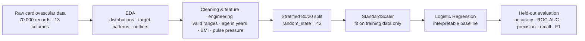

<div align="center">

# Cardiovascular Disease Prediction

#### Cleaning noisy health data into an interpretable baseline for cardiovascular-disease classification.

[](#quickstart)
[](notebooks/)
[](#modelling)
[](#the-data)
[](#the-finding-before-the-code)
[](#important-scope-and-limitations)

An end-to-end data-science project that explores, cleans, and models the [Kaggle Cardiovascular Disease Dataset](https://www.kaggle.com/datasets/sulianova/cardiovascular-disease-dataset). The central question is simple: **can demographic, clinical, anthropometric, and lifestyle variables help predict the binary `cardio` label?**

[Paper](cardiovascular_disease_paper.pdf) · [Exploration](notebooks/EDA.ipynb) · [Cleaning](notebooks/DataCleaning.ipynb) · [Baseline model](notebooks/MachineLearning.ipynb)

</div>

---

## The finding, before the code

The raw dataset contains implausible heights, weights, and blood-pressure readings—including impossible pressure values and inconsistent systolic/diastolic pairs. After conservative cleaning and the addition of **BMI** and **pulse pressure**, a stratified logistic-regression baseline improves from **0.763 ROC-AUC** to **0.795 ROC-AUC**.

| Evaluation on held-out data | Raw data | Cleaned data |
|---|:---:|:---:|
| Test observations | 14,000 | 13,713 |
| Accuracy | 0.70 | **0.727** |
| ROC-AUC | 0.763 | **0.795** |
| Recall — `cardio = 1` | 0.67 | 0.67 |
| F1 — `cardio = 1` | 0.69 | **0.71** |

The lesson is not that the model is ready for care. It is that **data quality changes what a model can learn**: removing clear measurement errors makes the signal in blood pressure and related features substantially more interpretable.

<div align="center">
  
  
</div>

---

## What this project does

The work follows one connected analytical path:



| Stage | Question answered | Main artifact |
|---|---|---|
| Exploratory analysis | What is in the data, and what looks implausible? | [`EDA.ipynb`](notebooks/EDA.ipynb) |
| Cleaning | Which rows and feature transformations make the data analysable? | [`DataCleaning.ipynb`](notebooks/DataCleaning.ipynb) |
| Baseline modelling | How well does an interpretable classifier generalise? | [`MachineLearning.ipynb`](notebooks/MachineLearning.ipynb) |
| Written report | What do the results mean—and where do they stop? | [`cardiovascular_disease_paper.pdf`](cardiovascular_disease_paper.pdf) |

---

## The data

The source is the public [Cardiovascular Disease Dataset on Kaggle](https://www.kaggle.com/datasets/sulianova/cardiovascular-disease-dataset). It contains **70,000 observations** and a nearly balanced binary target: `cardio = 0` indicates no recorded cardiovascular disease; `cardio = 1` indicates its presence.

| Feature family | Variables |
|---|---|
| Demographic | `age` (days in raw data), `gender` |
| Anthropometric | `height`, `weight` |
| Clinical | `ap_hi` (systolic BP), `ap_lo` (diastolic BP), `cholesterol`, `gluc` |
| Lifestyle | `smoke`, `alco`, `active` |
| Target | `cardio` |

The original `id` is removed before modelling. The ordinal clinical categories use the dataset’s supplied encoding: `1 = normal`, `2 = above normal`, and `3 = well above normal`.

### What EDA revealed

- No missing values, but meaningful quality problems: implausible body measurements, impossible blood-pressure values, and pressure pairs where `ap_lo > ap_hi`.
- Cardiovascular-disease prevalence rises markedly with age in this dataset.
- Higher cholesterol and glucose categories are associated with a greater observed share of `cardio = 1`.
- Smoking, alcohol use, and physical activity have much weaker *marginal* relationships in this sample; that does not establish an absence of causal effect.

---

## Cleaning & feature engineering

The cleaning rules are deliberately conservative: remove clear measurement errors while retaining plausible pathological values.

| Operation | Rule / result |
|---|---|
| Age | Convert days to `age_years` for interpretability |
| Identifier | Drop `id`—it has no clinical meaning |
| Height | Keep 140–210 cm |
| Weight | Keep 30–200 kg |
| BMI | Create `BMI = weight / height²`; keep 15–60 |
| Systolic pressure | Keep `ap_hi` between 80 and 250 mmHg |
| Diastolic pressure | Keep `ap_lo` between 40 and 200 mmHg |
| Pressure consistency | Correct inconsistent pairs before deriving features |
| Derived signal | Create pulse pressure: `pp = ap_hi - ap_lo` |

The resulting clean dataset contains **68,562 rows** and 13 model features plus the target.

> The project is transparent about cleaning choices because they are part of the model: they affect the distributions, correlations, and evaluation that follow.

---

## Modelling

**Why logistic regression?** The target is binary, and logistic regression gives an interpretable, reproducible baseline before considering more complex models.

| Decision | Implementation |
|---|---|
| Split | 80% training / 20% test, stratified by `cardio` |
| Reproducibility | `random_state=42` |
| Scaling | `StandardScaler` fit on training data only |
| Classifier | `LogisticRegression(max_iter=1000, solver="lbfgs")` with L2 regularisation |
| Evaluation | Accuracy, ROC-AUC, precision, recall, F1, and confusion matrix |

On the cleaned test split, the classifier correctly separates the classes moderately well (ROC-AUC 0.795), but it identifies only **67% of positive cases** at the evaluated threshold. That performance is unsuitable for medical decision-making.

### Signals in the fitted baseline

Because features are standardised, coefficient magnitudes are comparable within this linear model. The strongest positive coefficients are associated with systolic pressure, diastolic pressure, age, pulse pressure, and cholesterol. These are **model associations**, not clinical causation or validated feature importance—especially because pulse pressure is derived from the two blood-pressure variables.

---

## Repository map

```text
.
├── data/
│   ├── raw/cardio_train.csv             # original dataset
│   └── clean/cardio_cleaned.csv         # cleaned, feature-engineered data
├── notebooks/
│   ├── EDA.ipynb                        # distributions, relationships, outliers
│   ├── DataCleaning.ipynb               # validation rules and transformations
│   └── MachineLearning.ipynb            # baseline training and evaluation
├── cardiovascular_disease_paper.pdf     # full methods and results report
└── Phasen.md                            # project plan and hypotheses
```

---

## Quickstart

Use a Python environment with Jupyter and the core analysis libraries:

```bash
git clone https://github.com/theMindDeveloper/Cardiovascular_Disease_Prediction_Data_Science.git
cd Cardiovascular_Disease_Prediction_Data_Science

python -m venv .venv
# macOS / Linux
source .venv/bin/activate
# Windows PowerShell
# .\.venv\Scripts\Activate.ps1

pip install pandas numpy matplotlib seaborn scikit-learn jupyter
jupyter lab
```

Run the notebooks in this order:

1. `notebooks/EDA.ipynb`
2. `notebooks/DataCleaning.ipynb`
3. `notebooks/MachineLearning.ipynb`

The modelling notebook expects the cleaned file at `data/clean/cardio_cleaned.csv`. Re-running the cleaning notebook produces the analytical input used by the baseline.

---

## Important scope and limitations

This is an **educational data-science project**, not a clinical risk calculator.

- The Kaggle dataset is incompletely documented and may not represent a broader population.
- The target is a simplified binary label; it does not describe disease type, severity, progression, or diagnosis.
- The sample has an imbalanced gender-code distribution and relies on coarse, self-reported lifestyle variables.
- Results have not been externally validated, calibrated for clinical use, or evaluated as a medical decision rule.
- A false negative could be harmful in real healthcare; the observed positive-class recall (~0.67) makes clinical deployment inappropriate.
- Observational correlations and model coefficients do not prove causality.

For the full methodological discussion, data-quality rationale, and references, read the [project paper](cardiovascular_disease_paper.pdf).

---

<div align="center">

Built as a coursework project in exploratory analysis, data cleaning, feature engineering, and supervised machine learning.

**If you use this work, please keep the educational and non-clinical scope visible.**

</div>
